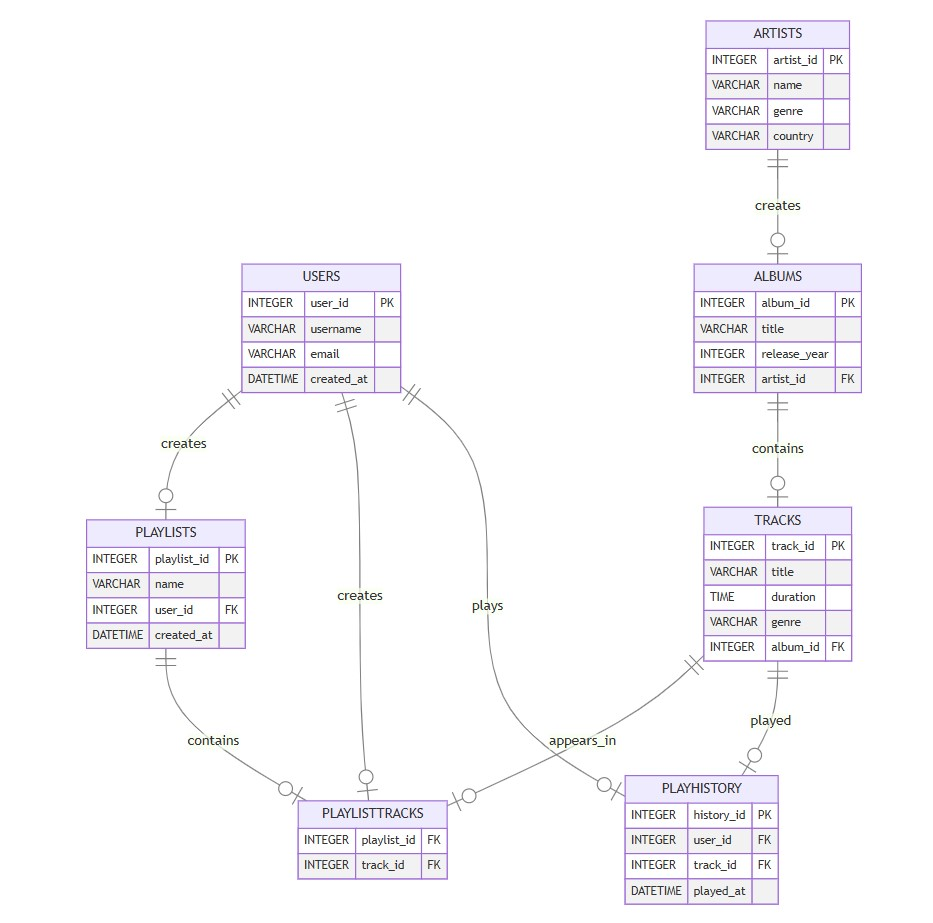

# Design Document

By Aarya Mahajan

Video overview: <[URL HERE](https://www.youtube.com/watch?v=uPtnxC5UU2I)>

# **Music Player Database**

## **Purpose**
The purpose of this project is to design a music player database that allows users to manage and access their music efficiently. This database will store information about users, songs, playlists, artists, and albums, simulating the backend of a real-world music streaming service like Spotify or Apple Music.

## **Scope**
The music player database is designed for personal use or as the foundation of a larger music streaming application. It supports:
- User account creation and management.
- Storage of songs with metadata such as title, duration, genre, and release year.
- Creation and management of playlists by users.
- Linking songs to artists and albums.
- Capturing playback history for personalized recommendations.

## **Entities**
1. **Users**: Represents the registered users of the music player application.
   - Attributes: `user_id`, `username`, `email`, `created_at`

2. **Artists**: Represents artists who have created songs.
   - Attributes: `artist_id`, `name`, `genre`, `country`

3. **Albums**: Represents collections of songs released by artists.
   - Attributes: `album_id`, `title`, `release_year`, `artist_id`

4. **Tracks**: Represents individual songs.
   - Attributes: `track_id`, `title`, `duration`, `genre`, `album_id`

5. **Playlists**: Represents user-created playlists.
   - Attributes: `playlist_id`, `name`, `user_id`, `created_at`

6. **PlaylistTracks**: A junction table linking tracks to playlists (many-to-many relationship).
   - Attributes: `playlist_id`, `track_id`

7. **PlayHistory**: Captures when and how many times a user has played a track.
   - Attributes: `history_id`, `user_id`, `track_id`, `played_at`

## **Relationships**
- Each **User** can have multiple **Playlists**, but a **Playlist** belongs to only one **User**.
- Each **Playlist** can contain multiple **Tracks**, and a **Track** can appear in multiple **Playlists**.
- Each **Album** is created by one **Artist**, but an **Artist** can create multiple **Albums**.
- Each **Track** belongs to one **Album**, and each **Album** contains multiple **Tracks**.
- Each **Track** can be played by multiple **Users**, and each **User** can play multiple **Tracks**.

## **Optimizations**
1. **Indexes**: Primary and foreign keys are indexed to improve query performance.
2. **Normalization**: The database is normalized to 3NF to minimize redundancy and ensure data integrity.
3. **Scalability**: The schema supports adding more features like collaborative playlists or song ratings.

## **Limitations**
1. The database does not include advanced features like real-time streaming or caching for playback.
2. It assumes all songs belong to an album, which may not be true for singles.
3. It does not include metadata for licensing or DRM management.

## **Entity Relationship Diagram**

The ERD illustrates the relationships and attributes of each entity in the database.

